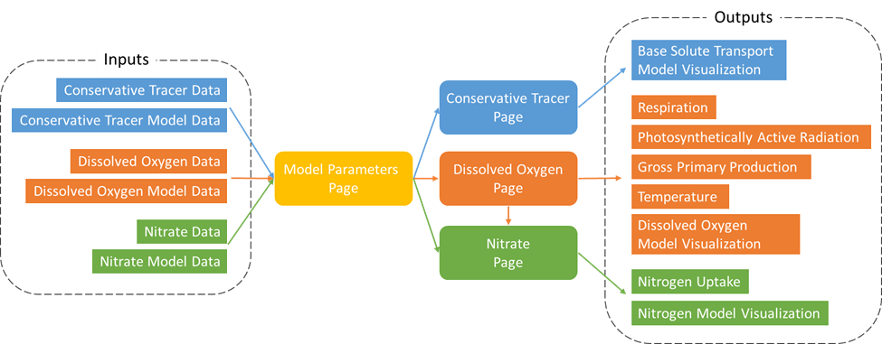

# SolTran Web Application
***Solute Transport Modeling R Shiny Application***

Andrew Hauer

*Masters of Science in Business Analytics (MSBA), University of Montana*

__PROJECT ABSTRACT__
This project involved designing and building a web application for understanding and analyzing reactive solute transport in the Clark Fork River of western Montana. Running water ecosystems (i.e., streams and rivers) are the primary means by which materials are moved from the continents to the oceans. Solutes, as a significant proportion of stream transport and retention, are elements or compounds that are dissolved in the water. Understanding how solutes flow, react and cycle within and between biofilm surfaces is a fundamental component of stream ecology. In this study and modeling effort, I developed a reactive solute transport web application using the dashboard design and modeling tools provided in R and the Shiny R package. For this project specific solutes, rhodamine dye, a conservative tracer, dissolved oxygen, and nitrogen in the form of nitrate were examined in a riverine waterway. The reactive solute transport tool, built in RStudio, is a data visualization tool for use by hydrologists, biologists, and biogeochemists working on solute transport and metabolism research in river and stream ecosystems. 

__APPLICATION CONCEPTUAL MODEL__

__PROJECT REFERENCES__

* Appling, Alison P., Robert O. Hall, Maite Arroita, and Charles B. Yackulic. 2018. "Overcoming Equifinality: Leveraging Long Time Series for Stream Metabolism Estimation." Journal of Geophysical Research: Biogeosciences 123 (2). doi:10.1002/2017JG004140.
* Bencala, Kenneth E., and Roy A. Walters. 1983. "Simulation of Solute Transport in a Mountain Pool-and-Riffle Stream: A Transient Storage Model." Water Resources Research 19 (3): 718-724. doi:10.1029/WR019i003p00718.
* Hensley, Robert T., and Matthew J. Cohen. 2016. "On the emergence of diel solute signals in flowing waters." Water Resources Research (American Geophysical Union) 52: 759-772. doi:10.1002/2015WR017895.
* Runkel, Robert L. 1998. One-Dimensional Transport with Inflow and Storage (OTIS): A solute transport model for streams and rivers. Water-Resources Investigation Report 98-4018, U.S. Department of the Interior, U.S. Geological Survey, Denver: USGS, 1 - 73.
* Stream Solute Workshop. 1990. "Concepts and Methods for Assessing Solute Dynamics in Stream Ecosystems." Journal of the North American Benthological Society 95-119.
* Tank, Jennifer L., Melody J. Bernot, and Emma J. Rosi-Marshall. 2007. "Nitrogen Limitation and Uptake." In Methods in Stream Ecology (Second Edition), by F. Richard Hauer and Gary A. Lamberti, 213-238. Burlington, MA: Elsevier.
* Webster, Jackson R., and H. Maurice Valett. 2007. "Solute Dynamics." In Methods in Stream Ecology (Second Edition), by F. Richard Hauer and Gary A. Lamberti, 169-185. Burlington, MA: Elsevier.

__SPECIAL THANKS__
* Dr. Rafael Feijó del Lima, Postdoctoral Researcher at the University of Montana, for his sharing of data and guidance in this capstone project. for Master of Science in Business Analytics.
* Dr. H. Maurice Valett, Professor of Systems Ecology at the University of Montana, for sharing his time and guidance in organizing this project.
* Dr. Robert Payn, Associate Professor and Hydrologist at Montana State University, for his help in putting together the models for the next version of the SolTran web application.

__NSF GRANT ACKNOWLEDGEMENT__

___"This material is based upon work supported in part by the National Science Foundation EPSCoR Cooperative Agreement OIA-1757351"___

___"Any opinions, findings, and conclusions or recommendations expressed in this material are those of the author(s) and do not necessarily reflect the views of the National Science Foundation."___

---

To use the Reactive Solute Transport Dashboard (SolTran), clone the SolTran repo and run the app.R Shiny Application in R. Libraries required include:

* library(shiny)
* library(shinyjs)
* library(htmlwidgets)
* library(bs4Dash)
* library(shinyTime)
* library(tidyverse)
* library(lubridate)
* library(DT)
* library(readr)

---

## Model Parameters and Data Input

### Templates

Data is input into the solute transport application in a series of templates available
from the application.

**Data Inputs**

_Conservative Tracer_

|Variable|Data Explanation|Data type|Example|
|--------|----------------|---------|-------|
|datetime|date and time of observation|datetime| yyyy-mm-dd hh:mm:ss|
|time_min|change in time for each observation|integer|1|
|us_sensor_obs|upstream sensor observation|float|1.0|
|ds_sensor_obs|downstream sensor observation|float|1.0|

_Dissolved Oxygen_

|Variable|Data Explanation|Data type|Example|
|--------|----------------|---------|-------|
|datetime|date and time of observation|datetime| yyyy-mm-dd hh:mm:ss|
|time_min|change in time for each observation|integer|1|
|us_station_obs|upstream sensor observation|float|1.0|
|ds_station_obs|downstream sensor observation|float|1.0|
|par|PAR estimate or observation|float|1.0|
|avgtemp|average temperature|float|1.0|

_Nitrate_

|Variable|Data Explanation|Data type|Example|
|--------|----------------|---------|-------|
|datetime|date and time of observation|datetime| yyyy-mm-dd hh:mm:ss|
|time_min|change in time for each observation|integer|1|
|us_station_obs|upstream sensor observation|float|1.0|
|ds_station_obs|downstream sensor observation|float|1.0|

**Model Inputs**

_Conservative Tracer Model_

|Variable|Data Explanation|Data type|Example|
|--------|----------------|---------|-------|
|datetime|date and time of observation|datetime| yyyy-mm-dd hh:mm:ss|
|time_min|change in time for each observation|integer|1|
|Loc_*n*m|Conserve Trace Model at each model location where n = distance from US observation|float|1.0|

_DO Model_

|Variable|Data Explanation|Data type|Example|
|--------|----------------|---------|-------|
|datetime|date and time of observation|datetime| yyyy-mm-dd hh:mm:ss|
|time_min|change in time for each observation|integer|1|
|Loc_*n*m|DO model at each model location where n = distance from US observation|float|1.0|

_Nitrate Model_

|Variable|Data Explanation|Data type|Example|
|--------|----------------|---------|-------|
|datetime|date and time of observation|datetime| yyyy-mm-dd hh:mm:ss|
|time_min|change in time for each observation|integer|1|
|Loc_*n*m|nitrate model at each model location where n = distance from US observation|float|1.0|

### Template Upload
Template formatted data is uploaded into each of its respective data input location.

**Example Data Sets**

The Upper Clark Fork River Datasets from a 2020 study between Cattle Road sensors and
Garrison sensors is available in this repository.

*Conservative Tracer* 

|Model Parameters|Value|
|----------------|-----|
|Segment distance (x)|86.40 m|
|Time (t)|1 min|

UCFR Conditions from Cattle Road to Garrison September 25, 2020, until September 30, 2020

*General Hydraulic Parameters*

|Hydraulic Parameter|Value|
|-------------------|-----|
|Reach Length (L)|4320 m|
|Discharge (Q)|6.1 m3/s|
|Ave. Depth (d)|0.6 m|
|Channel Area (A)|8.82 m2|
|Storage Area (As)|0.53 m2|
|Dispersion (D)|30.32 m2/s|
|Exchange Coeff (/alpha)|0.00004 1/s|

*DO Reactive Parameters*

|Reactive Parameter|Value|
|------------------|-----|
|Primary Production Rate Constant (kpp|0.000189 mg-O/J|
|Respiration Rate Constant (kER|0.0017 mg-O/m-2/d-1)|
|Respiration Coeff (nER)|0.2703 mg O2|/m2/d|
|k|0.000042 1/s|
|DOSAT|11.14 mg/L|

*Nitrate Reactive Parameters*

|Reactive Parameter|Value|
|------------------|-----|
|NPP:GPP|0.34 mol C: mol N|
|C:N|6.63 mol C: mol N|
|kD|0.00016|
|nD|1.78|

_Directories_

* example data templates: contains example data from the 2020 study for the data input
* example model data: contains example data model from each of the same 2020 study locations.

### Model Parameters

**Model Grid**

This section is for future development. The section allows users to set the distance 
between upstream and downstream observations. Users can then set the quantity of 
modeled observations between the upstream and downstream observation. 

**Measured Model Parameters**

These are model parameters which are measured in the field. Used for all models:

* Conservative Tracer
* Dissolved Oxygen
* Nitrate

*Average Depth is in meters (m)*

*Discharge is in cubic meters per second (m3/s)*

**Calculated Model Parameters**

These are model estimated parameters. Used for all models:

* Conservative Tracer
* Dissolved Oxygen
* Nitrate

*Channel Area in square meters (m2)*

*Storage Area in square meters (m2)*

*Dispersion in square meters per second (m2/s)*

*Exchange Coefficient in seconds (s)*

---

## Conservative Tracer

*Note: All visualizations and tables can be downloaded.* 

### Model Outputs

Select the model location. Visualization shows upstream and downstream curves. Model
will update based on model distance selected. Model summary statistics is output below the model selection.

### Conservative Tracer Model Prediction Statistics

Model prediction can be determined by setting the model to the downstream distance. This can be visualized on the Model Observed by Predicted visualization. Model Prediction Statistics are output to the right of the visualization.

### Conservative Tracer Model Table

The combined model input and observation values are output in a table. Select the desired model output for the table.

---

## Dissolved Oxygen

*Note: All visualizations and tables can be downloaded.* 

### Reactive Parameters

Refresh Page data when new data is loaded into the SolTran Application. This refresh will update all data inputs to the current data input. 

Input the kpp range and adjust the slider to enter the Primary Production Rate Constant. *This is an exploratory feature for future model data entry.*

Input the Respiration Rate Constant (kER). Average Respiration is calculate using the respiration rate constant, average depth, storage area, and area. 

*Average Respiration = (kER x depth x 1000) x (As/A) x 24000*

*numeric values, 1000 & 24000, for unit conversion*

### Photosynthetically Active Radiation (PAR)

PAR is input on the Dissolved Oxygen data input, template available on the Model Parameters page. Adjust the PAR slider input to see PAR Statistics and Detail Visualization for datetime range. Red vertical lines on the overall PAR visualization will adjust to display the input datetime range.

### Gross Primary Production (GPP)

GPP is calculated using PAR, kpp, and ave. depth. Adjust the GPP slider input to see GPP Statistics and Detail Visualization for datetime range. Red vertical lines on the overall GPP visualization will adjust to display the input datetime range.

*GPP = ((par x kpp)/depth))/1000*

*numeric value, 1000, for unit conversion*

### Water Temperature

Water temperature is given in degrees C and is the average temperature for the observed and modeled river segment. Temperature is input on the Dissolved Oxygen data input, template available on the Model Parameters page. Adjust the Temperature Time Input slider to see specific temperature for given datetime. 

### Dissolved Oxygen Diel Model Output

Input the desired model location distance from the selection box and datetime range from the datetime slider input. Dissolved Oxygen statistics and detailed visualization will be output for the selected model and datetime range. DO overall visualization displays 2 vertical red lines which indicate data selection.

### Dissolved Oxygen Model Prediction Statistics

To see the DO Model Observed by Predicted model performance set the DO model input to the downstream observation distance. The DO model observed by predicted and DO model prediction statistics will update to the input model.

### Dissolved Oxygen Model Table

The combined model input and observation values are output in a table. Select the desired model output for the table.

---

## Nitrate

*Note: All visualizations and tables can be downloaded.* 

### Reactive Parameters

Refresh Page data when new data is loaded into the SolTran Application. This refresh will update all data inputs to the current data input.

Input the C:N Ratio. This can be calculated or estimated with known values. 

The NPP:GPP Ratio is set to equal the GPP to Respiration Ratio. 

*GPP:ER Ratio = Average GPP/Average Respiration*

___NOTE: GPP and Respiration Must be calculated to find the GPP:ER Ratio or the NPP:GPP Ratio.___

*Average Associative Uptake* is calculated from the Associative Uptake value. This value is available in the Nitrate Model Table at the bottom of the Nitrate page. The avg. associative uptake value is given in mg-N/m2/day.

*Associative Uptake (UA) = ((GPP/32) x (C:N Ratio/GPP:NPP Ratio)) x 14*

*numeric value, 32 & 14, for unit conversion*

### Nitrate Diel Model Output

Input the desired model location distance from the selection box and datetime range from the datetime slider input. Nitrate statistics and detailed visualization will be output for the selected model and datetime range. Nitrate overall visualization displays 2 vertical red lines which indicate data selection.

### Nitrate Model Prediction Statistics

To see the Nitrate Model Observed by Predicted model performance set the Nitrate model input to the downstream observation distance. The Nitrate model observed by predicted and Nitrate model prediction statistics will update to the input model.

### Nitrate Model Table

The combined model input and observation values are output in a table. Select the desired model output for the table.
